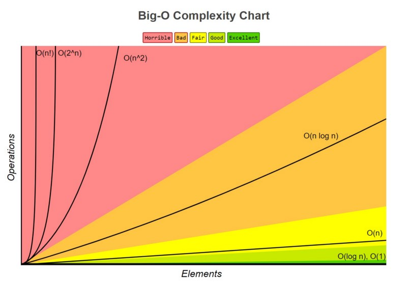

## BigO

Big O is used to classify algorithm scalability, measuring how long an algorithm takes to run.

## Cheat Sheet
- https://zerotomastery.io/cheatsheets/big-o-cheat-sheet
- https://www.bigocheatsheet.com/

### O(1) - Constant Time

Complexity is constant, no matter how many elements we have.

### O(n) - Linear Time

Complexity increases as elements and operations increase on the same amount.

### O(n²) - Quadratic Time

The operation quadratically increases with every element increased. Normally this means nested loops for example.

### O(n!) - Factorial Time

The most expensive, basically we're adding a nested loop for every element we iterate.

## Pillars

- **Readable**: Our code must be readable.
- **Memory**: Use BigO to measure space complexity, the memory required to run or algorithm.
- **Speed**: Use BigO to measure time complexity, how long that takes the algorithm to run.

